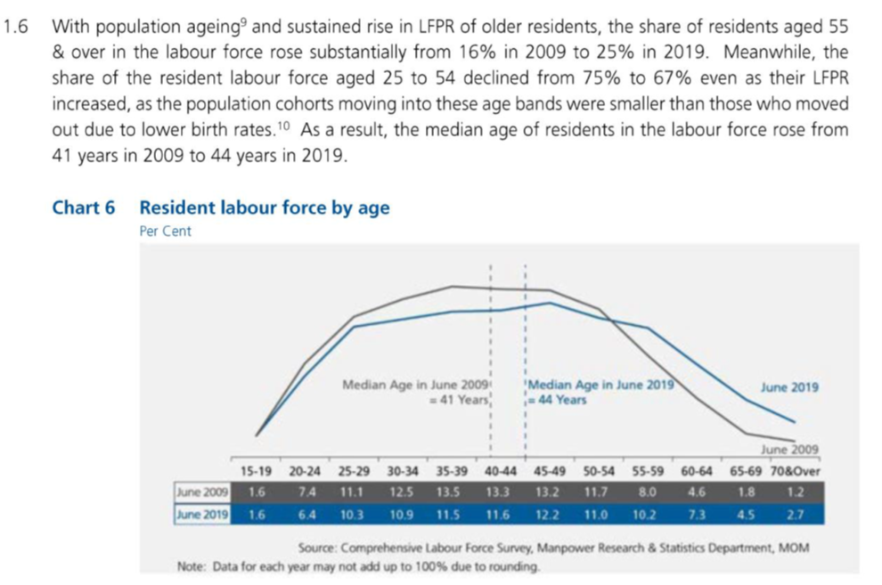
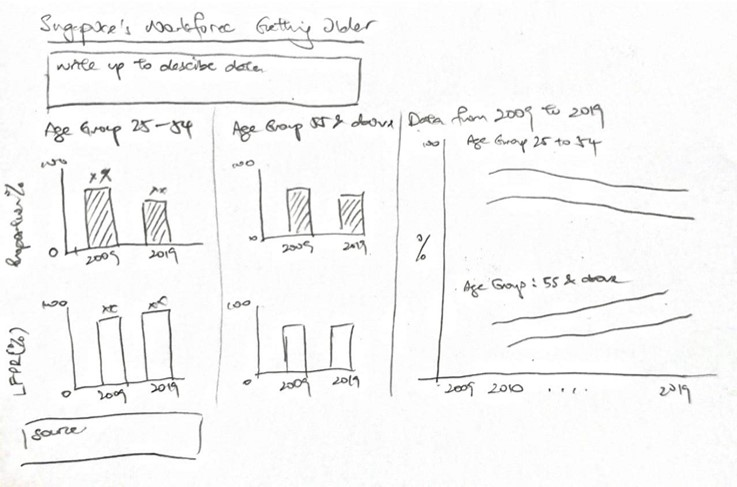

```{r setup, include=FALSE}
knitr::opts_chunk$set(echo = FALSE)
```

**ISSS608 Visual Analytics and Applications - DataViz Makeover 1**

[Data Visualization (Tableau Online)](https://public.tableau.com/profile/timothy.lim1214#!/vizhome/Assignment1_v4/Dashboard1?publish=yes)

Given chart:

```{r}

```

# 1.0 Data Visualization Critique

**1.1 Clarity**

a) Chart title can be clearer by including the time frame of comparison as well as being clear on what “per cent” refers to. 

b) The chart type used, a line-graph, is misleading as intuitively it seems like the resident labour force is being presented as labour force over time. However, the X-axis represents the various age groups, instead of time. 

c) The groupings discussed in the summary (aged 55 & over, 25 to 54) are not the groupings shown in the chart, where the groups are categorized in intervals of 5 years. Hence, data cited in the summary is not able to be immediately seen without calculation by adding the labour force percentages of the age groups. 

d) Y-axis is not presented in the chart. Instead, the values are shown below the X-axis. This makes it more difficult to correlate the significance of any rise and decline in the chart. 

e) From the chart, it is clear whether the resident labour force was higher or lower for each age group in June 2009 or June 2019 by looking at which line is higher than the other for each data point. This will be a point to be kept in view for the new design. 

**1.2 Aesthetics**

a) A brighter colour aside from grey could have been used for June 2009 data to further distinguish itself from the non-data ink such as the table’s borders or the text for source.  This allows text to have a greater contrast from the chart details.

b) The chart layout could be neater by aligning the source and note at the bottom, then further reducing the text.

c) In the summary, usage of font formatting can be used to attract readers’ attention on certain key points of focus, for example some of the percentage rise or decline.

d) Good use of colour to distinguish information related to June 2009 (grey) or June 2019 (blue) where the line graph, median line, text, labels, as well as the table of values are all coloured accordingly. This will be kept for the new design. 

# 2.0 The New Design

**2.1 Draft Design**

Taking into account the points mentioned above, a proposed design was drafted as below.

```{r}

```

Advantages of this design:

-	Will provide clearer comparisons between the different age groups – 25 to 54 and 55 & above as described in the summary given. 

-	The percentages mentioned can be clearly seen from each of the bar charts. 

-	The charts will have corresponding Y-axes to visualize the extent of growth or decline in each chart. 

-	Charts and plots will be colour coded for easy identification of each field or variable and clearly segregated bt age group.

-	Text inputs in the chart area can be clearer due to greater contrast by changing chart colours to brighter tones.


```{r}

```

