```{r setup, include=FALSE}
knitr::opts_chunk$set(echo = FALSE)
```

<font size="4.5">**ISSS608 Visual Analytics and Applications - DataViz Makeover 1**
<font size="4">

[Data Visualization (Tableau Online)](https://public.tableau.com/profile/timothy.lim1214#!/vizhome/Assignment1_v4/Dashboard1?publish=yes)

Given chart:

```{r}
knitr::include_graphics("givenchart.png")
```

# 1.0 Data Visualization Critique

<font size="5"> **1.1 Clarity**
<font size="4">

a) Chart title can be clearer by including the time frame of comparison as well as being clear on what “per cent” refers to. 

b) The chart type used, a line-graph, is misleading as intuitively it seems like the resident labour force is being presented as labour force over time. However, the X-axis represents the various age groups, instead of time. 

c) The groupings discussed in the summary (aged 55 & over, 25 to 54) are not the groupings shown in the chart, where the groups are categorized in intervals of 5 years. Hence, data cited in the summary is not able to be immediately seen without calculation by adding the labour force percentages of the age groups. 

d) Y-axis is not presented in the chart. Instead, the values are shown below the X-axis. This makes it more difficult to correlate the significance of any rise and decline in the chart. 

e) From the chart, it is clear whether the resident labour force was higher or lower for each age group in June 2009 or June 2019 by looking at which line is higher than the other for each data point. This will be a point to be kept in view for the new design. 

<font size="5">**1.2 Aesthetics**
<font size="4">

a) A brighter colour aside from grey could have been used for June 2009 data to further distinguish itself from the non-data ink such as the table’s borders or the text for source.  This allows text to have a greater contrast from the chart details.

b) The chart layout could be neater by aligning the source and note at the bottom, then further reducing the text.

c) In the summary, usage of font formatting can be used to attract readers’ attention on certain key points of focus, for example some of the percentage rise or decline.

d) Good use of colour to distinguish information related to June 2009 (grey) or June 2019 (blue) where the line graph, median line, text, labels, as well as the table of values are all coloured accordingly. This will be kept for the new design. 

# 2.0 The New Design

<font size="5">**2.1 Draft Design**
<font size="4">

Taking into account the points mentioned above, a proposed design was drafted as below.

```{r}
knitr::include_graphics("proposedchart.jpg")
```

**Advantages of this design:**

-	Will provide clearer comparisons between the different age groups – 25 to 54 and 55 & above as described in the summary given. 

-	The percentages mentioned can be clearly seen from each of the bar charts. 

-	The charts will have corresponding Y-axes to visualize the extent of growth or decline in each chart. 

-	Charts and plots will be colour coded for easy identification of each field or variable and clearly segregated bt age group.

-	Text inputs in the chart area can be clearer due to greater contrast by changing chart colours to brighter tones.

<font size="5">**2.2 Preparation of Data Visualization**
<font size="4">

Two data sources were used:

-	[Table 7: Resident labour force aged fifteen years and over by age and sex, 2009 – 2019 (June)](https://stats.mom.gov.sg/Pages/Labour-Force-Tables2019.aspx)
-	[Singapore Residents BY Age Group, Ethnic Group And Sex, End June, Annual](https://www.singstat.gov.sg/find-data/search-by-theme/population/population-and-population-structure/latest-data) 

**Preparing data source in Excel:**

Calculations from these two data sources were performed to create a new data table with age groups “25 to 54” and “55 & above” for labour force participation rate (LFPR) and labour force proportion with the following calculation method. 

-	LFPR = (Sum of labour force in age group / Sum of population in age group) *100

-	Labour force proportion = (Sum of labour force in age group / Total labour force) * 100

```{r}
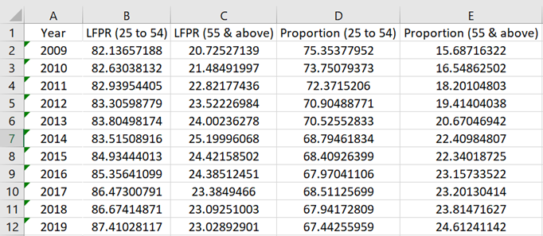
```

**Importing Data Into Tableau:**

The file was dragged and dropped into Tableau. Then, the Data sheet was dragged into the area labelled “Drag tables here”.

```{r}
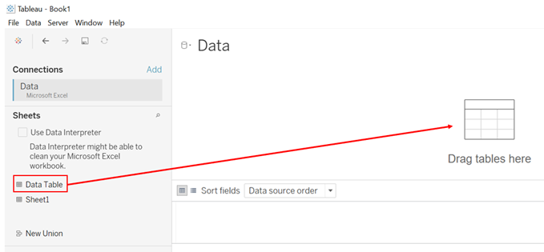
```

**Checking of Imported Data:**

The data type of Year was changed to “Date” as shown below. 

```{r}
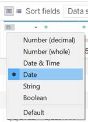
```

Data for LFPR and Proportion were ensured to be all in “Number (decimal)”.

```{r}
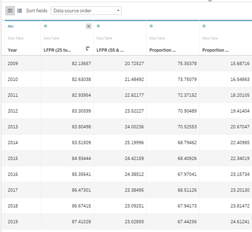
```

**Creating Bar Charts:**

To create the first chart for visualizing the data for “25 to 54”, the field “Year” was dragged into the Columns field. Then, “LFPR (25 to 54)” and Proportion (25 to 54)” were dragged into the Rows field. 

```{r}
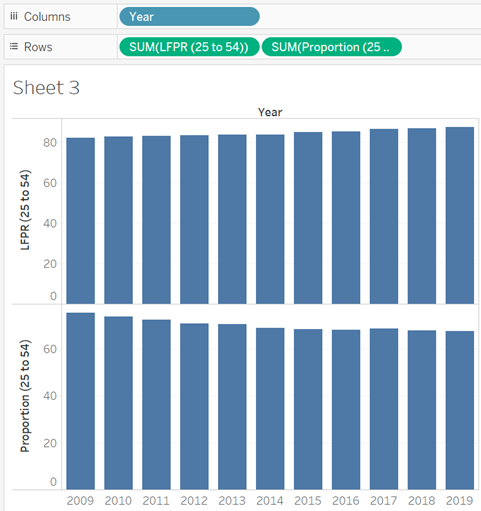
```

To see only data for 2009 and 2019, “Year” was dragged into the Filters space. Then, only 2009 and 2019 were checked.

```{r}
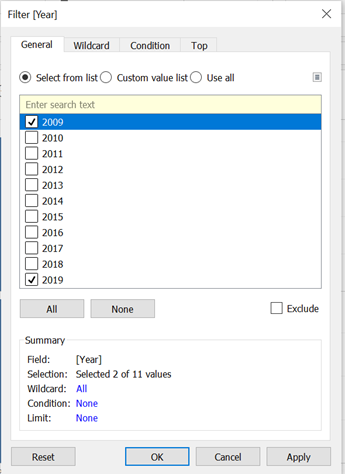
```

The chart title was renamed to “Age Group: 25 to 54”. 

```{r}
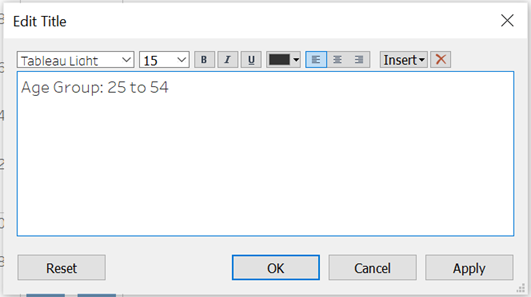
```

The proportion chart and LFPR chart were coloured to clearly identify which chart belongs to LFPR and which belongs to proportion. 

```{r}
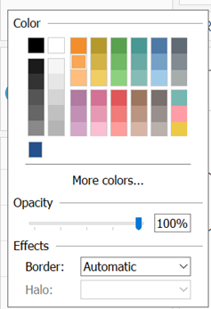
```

The Y-axis were edited to fix the range at 0% to 100% and to rename the axis. 

```{r}
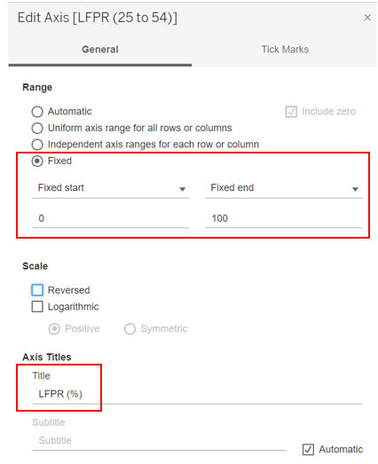
```

```{r}
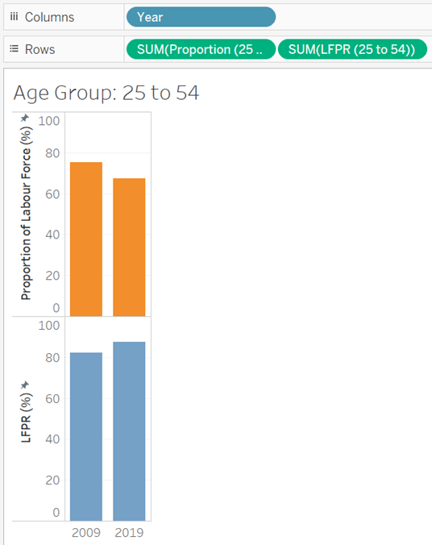
```

The same was repeated for age group 55 and above. 

**Creating the Line Chart:**

“Year” was dragged into the Columns field, while the other 4 fields were pulled into the Rows field. 

```{r}
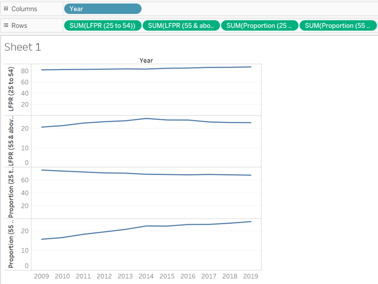
```

**Merging the Line Graphs Into One Chart:**

Since all 4 plots are in percentage, they can be merged into one chart. This was done by dragging the last three fields into the first chart’s axis.

```{r}
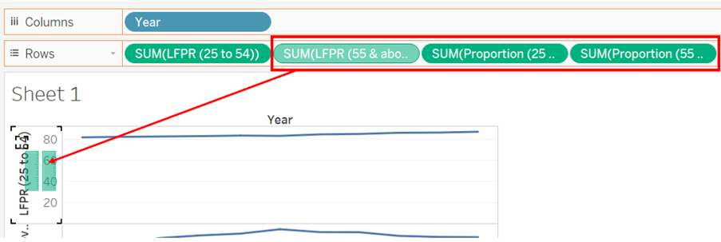
```

```{r}
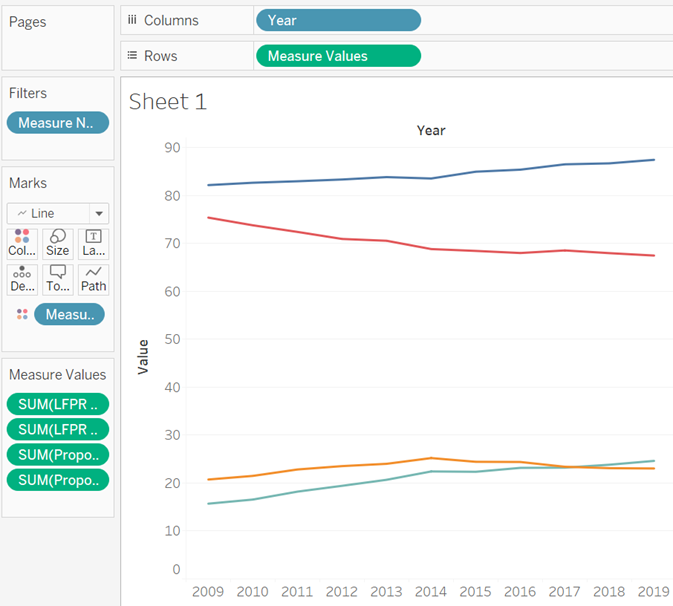
```

**Changing Y-Axis:**

To show the full 0% to 100%, the axis was edited by fixing the start and end of the range. 

```{r}
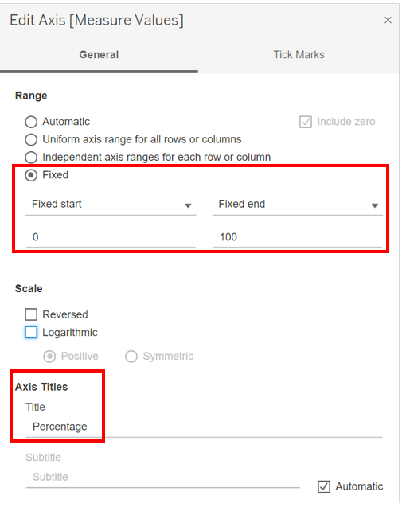
```

**Colour-coding LFPR and Proportion:**

To better visualize which plot refers to LFPR and Proportion, they were colour-coded by using the Edit Colours function. 

```{r}
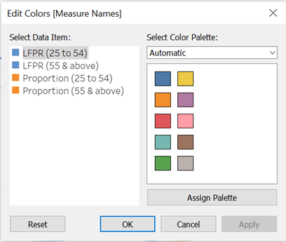
```

```{r}
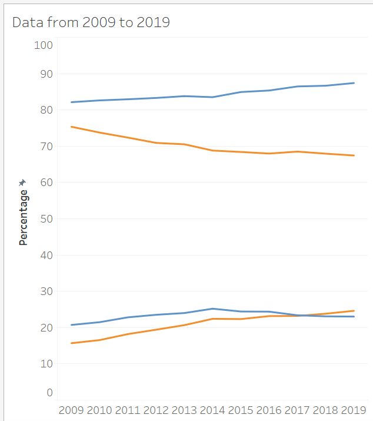
```

**Dashboard Assembly:**

The 3 worksheets were pulled into the dashboard. Textboxes were added for the chart title, short summary as well as the data source. Blank spaces were added to aid alignment. 

```{r}
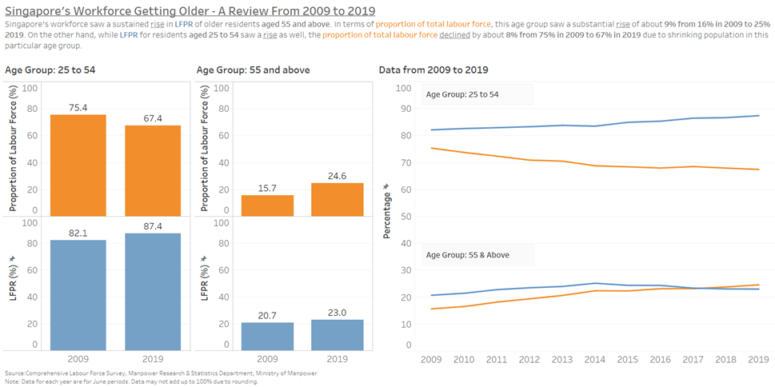
```

# 3.0 The Observations

1.	The growth of proportion in residents 55 and above in the labour force was substantial, rising by about 9%. While LFPR for both age groups increased, only age group 55 and above grew in proportion while age group 25 to 54 declined. This means that despite a proportion LFPR of people in age group 25 to 54 being part of the labour force, the contribution by this age group to total labour force still declined, showing that the population of this age group was shrinking. 

2.	While there was a slight growth in LFPR for age group 25 to 54 from 2009 to 2019 (about 5%), it might be assumed that this is a steady rise. However, from the graph we can see that it only grew from 2009 to 2014, then started to decline from 2014 onwards steadily. This was not able to be captured if only data from 2009 and 2019 was taken for study. There might be an event that caused this age group to deviate from joining the work force, with reasons such as a push for furthering studies, or a significant proportion of the older residents who were contributing in LFPR in this age group transiting to the next age group (55 and above) from 2014 onwards. 

3.	The rise and decline for proportion of labour force are generally following a trend, with age group 25 to 54 seeing a steady decline while age group 55 and above a steady rise. This can be explained with the findings of Singapore’s shrinking birth rate, resulting in smaller population for each subsequent younger age group. 


