```{r setup, include=FALSE}
knitr::opts_chunk$set(echo = FALSE)
```

<font size="5">**ISSS608 Visual Analytics and Applications - DataViz Makeover 2**
<font size="4">

[Data Visualization (Tableau Online)](https://public.tableau.com/profile/timothy.lim1214#!/vizhome/DataVizMakeover2_16136340047980/Dashboard1?publish=yes)

Given chart:

```{r}
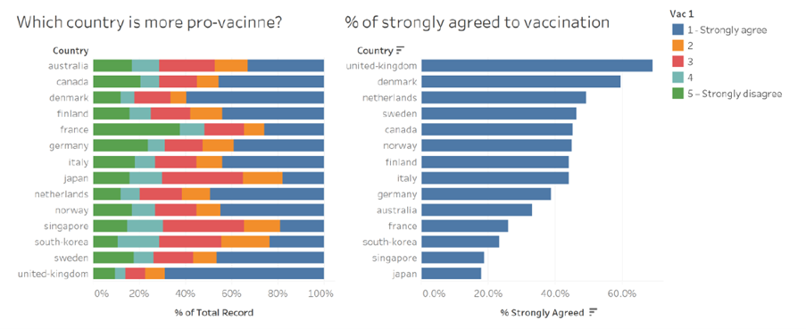
```

# 1.0 Data Visualization Critique

<font size="5"> **1.1 Clarity**
<font size="4">

The given diagram consists of two charts, with the Likert chart on the left visualizing which country is more pro-vaccine, and a bar chart on the right which attempts to visualize the percentage of those who strongly agree to vaccination in each country. 

For easier identification in the critique of the two charts, the Likert chart on the left will be referred to as Chart A, while the bar chart on the right will be referred to as Chart B. 

a)	The chart title for Chart A, “Which country is more pro-vaccine” is not answered in the chart where no findings or answers can be intuitively found from the chart. The response of agree or disagree is not an appropriate response to this title as well. Instead, the chart title can indicate what the chart is about, for example the proportion of responses for survey question. 

b)	The colours used for the chart may be confusing as every response is given a different colour. The colours used may be misleading as well, for example red representing score of 3, which is a neutral score. However, red is usually associated with something negative. A colour gradient might be able to better portray the varying response since they are ordinal data with appropriate colours. 

c)	As the proportions for each response across the different countries do not have a common or baseline reference, it is difficult to make comparisons between countries, especially when the differences are not significant. A diverging stacked bar chart might make it easier to perform comparisons. 

d)	The axes are clearly labelled, to indicate the country as well as the percentage response. 

e)	Chart B is sorted in descending order which makes it clear which country has the highest percentage of respondents giving a “Strongly Agree” response to the survey question. 


<font size="5">**1.2 Aesthetics**
<font size="4">

a)	The label of “vac_1” above the legend is not useful in this case which may end up confusing readers on what the response means. It can be removed as the legend is intuitive enough without a title. 

b) Scores 2 to 4 do not have any indication on what the response is. It will be clearer to indicate “Agree”, “Neutral” and “Disagree” for scores 2 to 4 respectively. 

c) Country names are in the lower case when they should be capitalized, since country names are nouns. 

d) Colours used in both charts are consistent, where percentage strongly agree in Chart B is also indicated in blue, similar to Chart A. 

e) The source of the data is not provided. 


# 2.0 The New Design

<font size="5">**2.1 Draft Design**
<font size="4">

Taking into account the points mentioned above, a proposed design was drafted as below.


**Advantages of this design:**
-	Title to clearly defined to correctly represent the data presented

-	Gradient of colours to be used to indicate the varying degree of agreeability, with neutral marked as grey

-	Utilize diverging stacked bar chart where there is a baseline reference in the middle of the neutral input

-	Legend to indicate response in words rather than numbers to have clarity on the response types

-	Country names capitalized

-	Add source of data

-	Present Chart B as an error plot to take into account the sample size from the survey (to present at 95% confidence level)

-	To add demographics selection for users to see how with adding or removing a certain demographic changes the final response


<font size="5">**2.2 Preparation of Data Visualization**
<font size="4">

The data used was obtained from [Imperial College London YouGov Covid 19 Behaviour Tracker Data Hub](https://github.com/YouGov-Data/covid-19-tracker).

The data obtain consisted of 30 csv files, each presenting data from a country. However, not all 30 were shown in the given chart, such as Brazil and China. Hence, the data sets not required were removed from the folder, leaving behind the data sets for the 14 countries presented. 


**Preparing data source in Excel:**


Each of the datasets were opened to be reviewed and there were a few observations:

- Not all fields were useful for this visualization, hence they were be removed. 

- For the survey responses, there were multiple empty fields. This was be taken into account subsequently, resolved with a filter to exclude null values. 


- The fields for employment status varied from file to file (see below). This was resolved by creating new calculated fields discussed later. 

Input method 1:

```{r}
knitr::include_graphics("employment1.png")
```

Input method 2:

```{r}
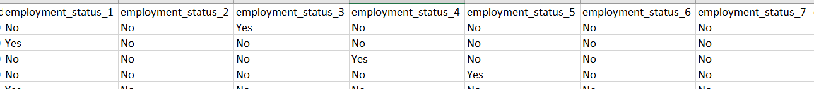
```

The remaining fields are:

-	RecordNo

-	Household_children

-	Household_size

-	Age

-	Gender

-	Employment_status (or Employment_status1 to Employment_status7)

-	Vac_1

-	Vac_2

-	Vac2_1

-	Vac2_2

-	Vac2_3

-	Vac2_6

-	Vac3


**Importing Data Into Tableau:**

The australia.csv file was dragged and dropped into Tableau. 

```{r}
knitr::include_graphics("ImportAustralia.png")
```

To create a new union, the australia.csv file was removed, then New Union was selected where the datasets for the 14 countries were pulled in. 

```{r}
knitr::include_graphics("RemoveAustralia.png")
```

```{r}
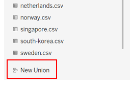
```

```{r}
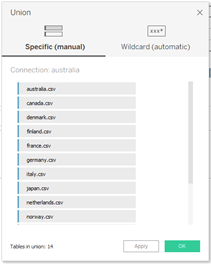
```

To have a field which indicates which Country the datapoint is for, the Table Names column which was automatically generated through the New Union function was used. The field title was double clicked and changed to Country. Aliases were also created to ensure the country names are without the “.csv” and with the first letter being upper case. 

```{r}
knitr::include_graphics("Changetablename.png")
```

```{r}
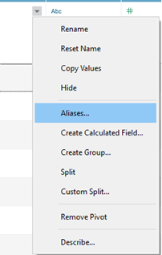
```

```{r}

```

```{r}
knitr::include_graphics("CountryAliase.png")
```

The survey questions, were highlighted and pivoted, using the Pivot function under the small triangle dropdown icon. 

```{r}
knitr::include_graphics("Pivot.png")
```

The field names of the two newly created fields were changed to “Survey Question” and “Response”. Aliases were also created for Survey Question, where the respective questions were used as the Alias.  

```{r}
knitr::include_graphics("EditPivotNames.png")
```

```{r}
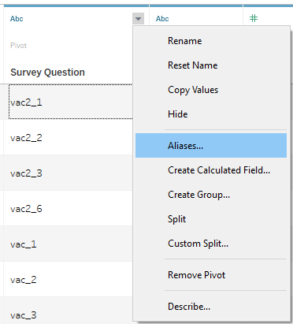
```

```{r}
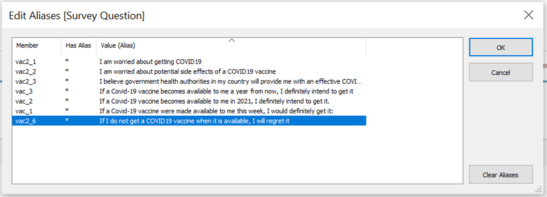
```

```{r}
knitr::include_graphics("numericresponse.png")
```

```{r}
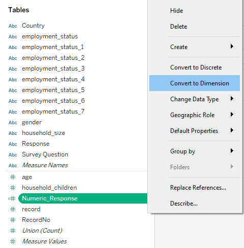
```

```{r}
knitr::include_graphics("pullinnumericresponse.png")
```

```{r}
knitr::include_graphics("filternumericresponse.png")
```

```{r}
knitr::include_graphics("numericresponsealiase.png")
```

```{r}
knitr::include_graphics("editnumericresponsealiase.png")
```

```{r}
knitr::include_graphics("noofrecords.png")
```

```{r}
knitr::include_graphics("totalcount.png")
```

```{r}
knitr::include_graphics("countnegative.png")
```

```{r}
knitr::include_graphics("proportion.png")
```

```{r}
knitr::include_graphics("ganttstart.png")
```

```{r}
knitr::include_graphics("ganttproportion.png")
```

```{r}
knitr::include_graphics("pullinganttproportion.png")
```

```{r}
knitr::include_graphics("pullinsurveyquestion.png")
```

```{r}
knitr::include_graphics("filtersurveyquestion.png")
```

```{r}
knitr::include_graphics("pullincountry.png")
```

```{r}
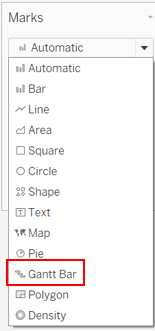
```

```{r}
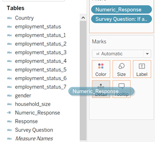
```

```{r}
knitr::include_graphics("computeusing.png")
```

```{r}
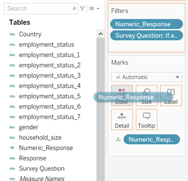
```

```{r}
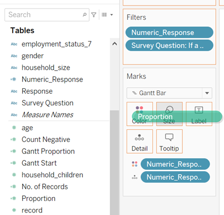
```

```{r}

```

```{r}

```

```{r}
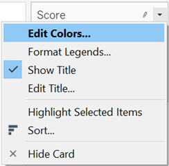
```

```{r}
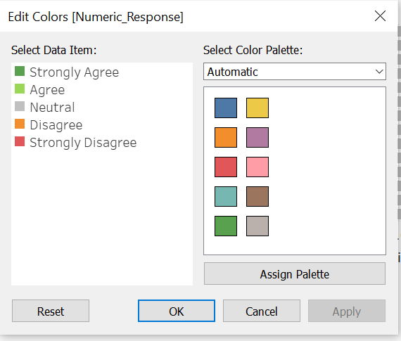
```

```{r}
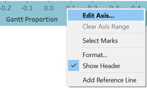
```

```{r}
knitr::include_graphics("reverseaxis.png")
```

```{r}
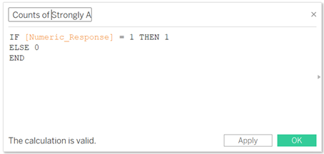
```

```{r}
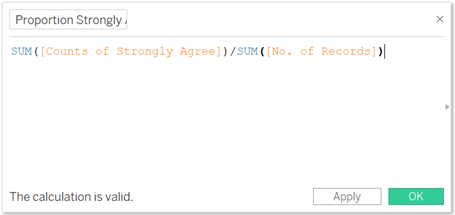
```

```{r}
knitr::include_graphics("propstandarderror.png")
```

```{r}
knitr::include_graphics("zscore.png")
```

```{r}
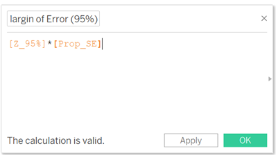
```

```{r}
knitr::include_graphics("upperliit.png")
```

```{r}
knitr::include_graphics("lowerlimit.png")
```

```{r}

```

```{r}
knitr::include_graphics("pullinproportion.png")
```


```{r}
knitr::include_graphics("selectcircle.png")
```

```{r}
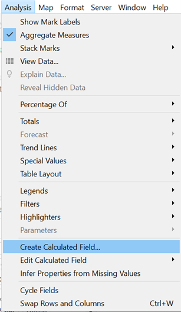
```

```{r}
knitr::include_graphics("numericresponseformula.png")
```


