```{r setup, include=FALSE}
knitr::opts_chunk$set(echo = FALSE)
```

<font size="5">**ISSS608 Visual Analytics and Applications - DataViz Makeover 2**
<font size="4">

[Data Visualization (Tableau Online)](https://public.tableau.com/profile/timothy.lim1214#!/vizhome/DataVizMakeover2_16136340047980/Dashboard1?publish=yes)

Given chart:

```{r}
knitr::include_graphics("givenchart.png")
```

# 1.0 Data Visualization Critique

<font size="5"> **1.1 Clarity**
<font size="4">

The given diagram consists of two charts, with the Likert chart on the left visualizing which country is more pro-vaccine, and a bar chart on the right which attempts to visualize the percentage of those who strongly agree to vaccination in each country. 

For easier identification in the critique of the two charts, the Likert chart on the left will be referred to as Chart A, while the bar chart on the right will be referred to as Chart B. 

a)	The chart title for Chart A, “Which country is more pro-vaccine” is not answered in the chart where no findings or answers can be intuitively found from the chart. The response of agree or disagree is not an appropriate response to this title as well. Instead, the chart title can indicate what the chart is about, for example the proportion of responses for survey question. 

b)	The colours used for Chart A may be confusing as every response is given a different colour. The colours used may be misleading as well, for example red representing score of 3, which is a neutral score. However, red is usually associated with something negative. A colour gradient with appropriate colours might be able to better portray the varying response since they are ordinal data. 

c)	As the proportions for each response across the different countries in Chart A do not have a common or baseline reference, it is difficult to make comparisons between countries, especially when the differences are not significant. A diverging stacked bar chart might make it easier to perform comparisons. 

d)	For both charts, the axes are clearly labelled, to indicate the country as well as the percentage response. 

e)	Chart B is sorted in descending order which makes it clear which country has the highest percentage of respondents giving a “Strongly Agree” response to the survey question. 


<font size="5">**1.2 Aesthetics**
<font size="4">

a)	The label of “vac_1” above the legend is not useful in this case which may end up confusing readers on what the response means. It can be removed as the legend is intuitive enough without a title. 

b) Scores 2 to 4 do not have any indication on what the response is. It will be clearer to indicate “Agree”, “Neutral” and “Disagree” for scores 2 to 4 respectively. 

c) Country names are in the lower case when they should be capitalized, since country names are nouns. 

d) Colours used in both charts are consistent, where percentage strongly agree in Chart B is also indicated in blue, similar to Chart A. 

e) The source of the data is not provided. 


# 2.0 The New Design

<font size="5">**2.1 Draft Design**
<font size="4">

Taking into account the points mentioned above, a proposed design was drafted as below.

```{r}
knitr::include_graphics("draft.png")
```


**Advantages of this design:**

-	Title to clearly defined to correctly represent the data presented

-	Gradient of colours to be used to indicate the varying degree of agreeability, with neutral marked as grey

-	Utilize diverging stacked bar chart where there is a baseline reference in the middle of the neutral input

-	Legend to indicate response in words rather than numbers to have clarity on the response types

-	Country names capitalized

-	Add source of data

-	Present Chart B as an error plot to take into account the sample size from the survey (to present at 95% confidence level)

-	To add demographics selection for users to see how with adding or removing a certain demographic changes the final response


<font size="5">**2.2 Preparation of Data Visualization**
<font size="4">

The data used was obtained from [Imperial College London YouGov Covid 19 Behaviour Tracker Data Hub](https://github.com/YouGov-Data/covid-19-tracker).

The data obtained consists of 30 csv files, each presenting data from a country. However, not all 30 were shown in the given chart, such as Brazil and China. Hence, the data sets not required were removed from the folder, leaving behind the data sets for the 14 countries presented. 


**Preparing data source in Excel:**


Each of the datasets were opened to be reviewed and there were a few observations:

- Not all fields were useful for this visualization, hence they were removed. 

- For the survey responses, there were multiple empty fields. This was taken into account subsequently, resolved with a filter to exclude null values. 


- The fields for employment status varied from file to file (see below). This was resolved by creating new calculated fields discussed later. 

Input method 1:

```{r}
knitr::include_graphics("employment1.png")
```

Input method 2:

```{r}
knitr::include_graphics("employment2.png")
```

The remaining fields are:

-	RecordNo

-	Household_children

-	Household_size

-	Age

-	Gender

-	Employment_status (or Employment_status1 to Employment_status7)

-	Vac_1

-	Vac_2

-	Vac2_1

-	Vac2_2

-	Vac2_3

-	Vac2_6

-	Vac3


**Importing Data Into Tableau and Data Preparation:**

The australia.csv file was dragged and dropped into Tableau. 

```{r}
knitr::include_graphics("ImportAustralia.png")
```

To create a new union, the australia.csv file was first removed, then New Union was selected where the datasets for the 14 countries were pulled in. 

```{r}
knitr::include_graphics("RemoveAustralia.png")
```

```{r}
knitr::include_graphics("NewUnion.png")
```

```{r}
knitr::include_graphics("UnionAll.png")
```

To have a field which indicates which Country the datapoint is for, the Table Names column which was automatically generated through the New Union function was used. The field title was double clicked and changed to Country. Aliases were also created to ensure the country names are without the “.csv” and with the first letter being upper case. 

```{r}
knitr::include_graphics("Changetablename.png")
```

```{r}
knitr::include_graphics("CreateAlias.png")
```

```{r}
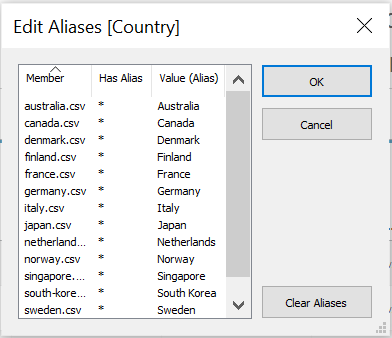
```

The survey questions were highlighted and pivoted, using the Pivot function under the small triangle dropdown icon. 

```{r}
knitr::include_graphics("Pivot.png")
```

The field names of the two newly created fields were changed to “Survey Question” and “Response”. Aliases were also created for Survey Question, where the respective questions were used as the alias.  

```{r}
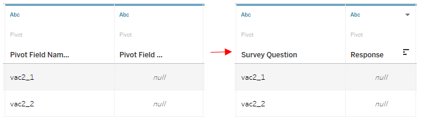
```

```{r}
knitr::include_graphics("surveyquestionaliase.png")
```

```{r}
knitr::include_graphics("EditSurveyAlises.png")
```

Since the responses were identified as strings due to characters such as in "1 - Strongly Agree", for the chart to be plotted with scores that use integers, a new calculated field was created by using the Create Calculated Field function with the following formula.

```{r}
knitr::include_graphics("createcalculatedfield.png")
```

```{r}
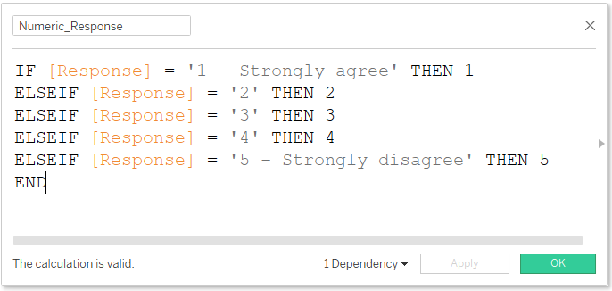
```


**Creating The Diverging Stacked Bar Chart:**

Moving to Sheet 1, the field numeric_response was converted to dimension by clicking on the small triangle drop down icon on it and selecting Convert to Dimension. 

```{r}
knitr::include_graphics("converttodimension.png")
```

To first remove null response values, "Numeric_Response" was dragged to the Filter field. Here, null values were excluded by checking “Null” and checking the “Exclude” checkbox. 

```{r}
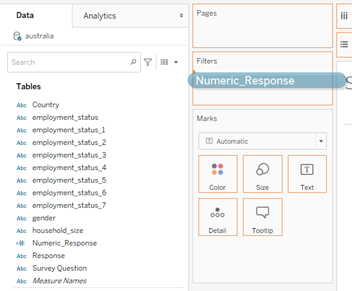
```

```{r}
knitr::include_graphics("filternumericresponse.png")
```

To show the description of each score, aliases were given to each of the input scores. 

```{r}
knitr::include_graphics("numericresponsealiase.png")
```

```{r}
knitr::include_graphics("editnumericresponsealiase.png")
```

In order to calculate the proportions of the responses in a diverging stacked bar chart, the following new calculated fields were created with the following formula:

```{r}
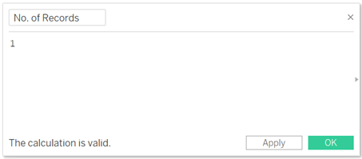
```

```{r}
knitr::include_graphics("totalcount.png")
```

```{r}
knitr::include_graphics("countnegative.png")
```

```{r}
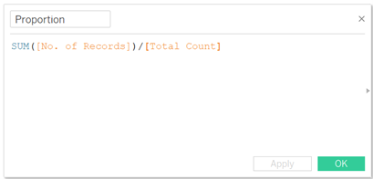
```

```{r}
knitr::include_graphics("ganttstart.png")
```

```{r}
knitr::include_graphics("ganttproportion.png")
```

Then, Gantt Proportion was dragged into the Columns field, followed by Survey Question into the Filters field where vac_1, now aliased to “If a Covid-19 vaccine were made available to me this week, I would definitely get it:” was selected. This is to set responses in the diverging stacked bar chart to reflect only responses in for this specific survey question. 

```{r}
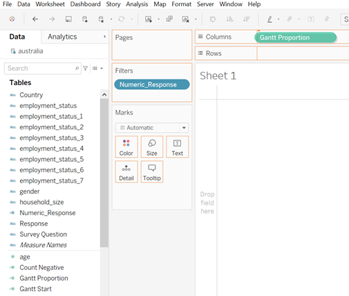
```

```{r}
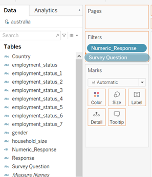
```

```{r}
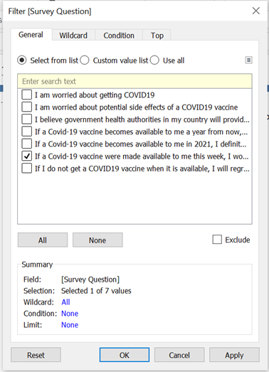
```

The field "Country" was pulled into the Rows field 

```{r}
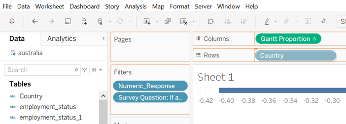
```

Under Marks, the Gantt Bar chart type was selected. 

```{r}
knitr::include_graphics("selectganttbar.png")
```

Subsequently, "Numeric_Response" was pulled into the Detail icon.

```{r}
knitr::include_graphics("numericresponsetodetail.png")
```

The "Gantt Proportion" in the Columns field was computed using "Numeric_Response". 

```{r}
knitr::include_graphics("computeusing.png")
```

To identify each survey response with a differenet colour, "Numeric_Response" was dragged into the Color icon.

```{r}
knitr::include_graphics("numericresponsetocolor.png")
```

To visualize the length of the chart based on proportion, "Proportion" was dragged into the Size icon. 

```{r}
knitr::include_graphics("proportiontosize.png")
```

To create a gradient of colours for the responses, under the triangle drop down icon of the legend, the Edit Colors function was selected. Colours were chosen to reflect the common association with green being agree and red being disagree. Further, strongly agree and strongly disagree were chosen to be indicated by darker shades of green and red respectively. Neutral was indicated as grey.  

```{r}
knitr::include_graphics("editcolours.png")
```

```{r}
knitr::include_graphics("selectcolours.png")
```

Next, to present the chart with agree on the right side per the given chart, the Edit Axis function was utilized where both Synchronize Axis and Reversed was selected. 

```{r}
knitr::include_graphics("syncaxes.png")
```

```{r}
knitr::include_graphics("editaxis.png")
```

```{r}
knitr::include_graphics("reverseaxis.png")
```


**Creating The Error Plot:**

A new sheet was created and new calculated fields were created as follows:

```{r}
knitr::include_graphics("countsofstronglyagree.png")
```

```{r}
knitr::include_graphics("proportionstronglyagree.png")
```

```{r}
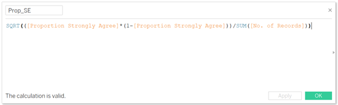
```

```{r}
knitr::include_graphics("zscore.png")
```

```{r}
knitr::include_graphics("marginoferror.png")
```

```{r}
knitr::include_graphics("upperliit.png")
```

```{r}
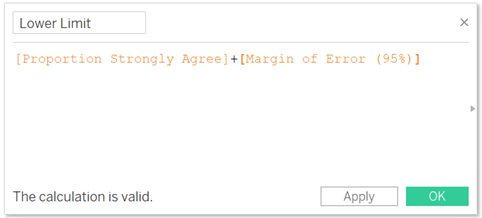
```

The field "Proportion" was pulled into the Columns field.

```{r}
knitr::include_graphics("pullinproportion.png")
```

From Marks, Circle was selected. 

```{r}
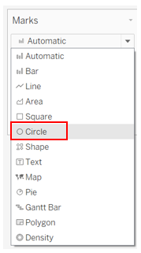
```

With the same steps from before, null values were removed by filtering "Numeric_Response" and to address one survey question at a time, "Survey Question" was filtered as well. Since the error plot is to provide insights on the other survey questions also, the Show Filter option was selected. 

```{r}
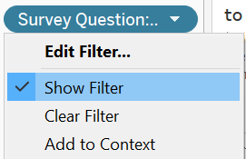
```

Next, "Country" was pulled into the Rows field. 

```{r}
knitr::include_graphics("pullcountrytofields.png")
```

Then, Measure Values was pulled to the top of the chart. Subsequently, all fields were removed asides from "Lower Limit" and "Upper Limit". 

```{r}
knitr::include_graphics("pullmeasuredvaluestoaxis.png")
```

```{r}
knitr::include_graphics("removemeasurefields.png")
```

Then, the x-axis was synchronized. 

```{r}
knitr::include_graphics("syncaxes.png")
```

Under "Measure Values" in Marks, the Line chart was selected. Then, Measure Names was pulled into the Path icon. 

```{r}
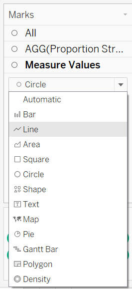
```

```{r}
knitr::include_graphics("measurednamestopath.png")
```

The colour was edited to be identical to the first chart where green colour was used to represent Strongly Agree. 

```{r}
knitr::include_graphics("colourchangeproportion.png")
```

**Creating New Fields For Demographics:**

For both Age Group and Household Size, the Create Group function was used to create groups. For Age Group, asides from 18 to 25 and 76 and above, the remaining ages were split into groups of 10 years intervals. As for Household Size, inputs "Null", "Don't know" and "Prefer not to say" were grouped as one, 1 to 3 was grouped as one, 4 to 6 in another and 7 or more forming the last group. The names of each group was also edited for clarity. 

```{r}
knitr::include_graphics("creategroups.png")
```

```{r}
knitr::include_graphics("agegroup.png")
```

```{r}
knitr::include_graphics("householdsize.png")
```

For employment, as mentioned earlier, more work is required to resolve the difference in input methods. Firstly, a new calculated field was created to combine all the inputs for "employment_status1" to "employment_status7". 

```{r}
knitr::include_graphics("employment1to7.png")
```

Then, another new calculated field was used to collate all inputs of "Employment 1-7", and in instances of null, it will take the input of "employment_status". This hence combines both methods of inputs for employment status. 

```{r}
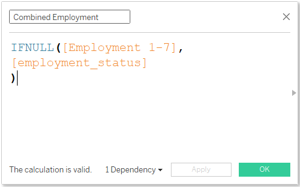
```

The filters of "gender", "Age Groups", "Household Size" and "Combined Employment" were then added into the Filters field, along with "Numeric_Response" and "Survey Question". Then, to apply only "gender", "Age Groups", "Household Size" and "Combined Employment" to the diverging stacked bar chart, "All Using This Data Source" were selected for these fields.

Since for Survey Question it makes sense only if the response is to one question, the filter was changed to Single Value (list) while the rest remained with Multiple Values (list). This will allow users to visualize different combinations of demographics. After all is prepared, the selection Show Filter was selected. 

```{r}
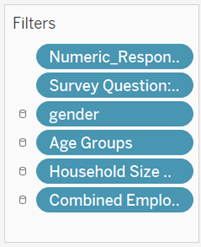
```

```{r}
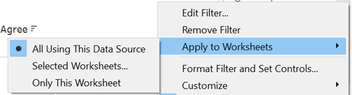
```

```{r}
knitr::include_graphics("singlevalue.png")
```

Next, animations were selected so that users can see how data changes in a clearer way. 

```{r}
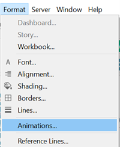
```

```{r}
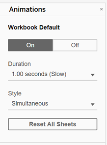
```

**Creating The Dashboard:**

A new dashboard was created and the Size was selected to be Automatic. 

```{r}
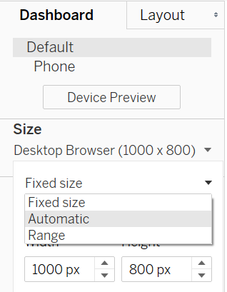
```

Sheet 1 and Sheet 2 were subsequently dragged into the dashboard field. Along with Sheet 2, the filters were added as well. The sheet titles were edited to describe the respective charts. In addition, a short sentence to describe how it can be tweaked with the filters available was given, so that users know how to utilize the interactivity. For Sheet 2, another line to indicate the 95% confidence level was added for clarity on the lines presented in the chart. 

```{r}
knitr::include_graphics("importsheet1and2.png")
```

To create a space between the charts to ensure that it is not too cluttered, a blank was placed in the middle. 

```{r}
knitr::include_graphics("insertblank.png")
```

As the survey questions would be too long to be put at the side, it was dragged down to the bottom of the dashboard so that the entire question can be seen at one glance. As there was additional space beside the survey questions, the space was utlized by putting in a blank and dragging Employment down beside it so that more demographics selection can be seen. 

```{r}
knitr::include_graphics("surveyquestionbelow.png")
```

Lastly, the source was added right at the bottom of the chart using the Text function.

```{r}
knitr::include_graphics("source.png")
```

This is the final layout of the dashboard.

```{r}
knitr::include_graphics("finaldashboard.png")
```

# 3.0 The Observations

1.	By comparing the results from the error plot between male and female respondents for those who strongly agree to the question "If a Covid-19 vaccine becomes available to me in 2021, I definitely intend to get it", it can be observed from ther error plot that females are more agreeable to get vaccinated. This observation is the same through all countries. 

```{r}
knitr::include_graphics("comparemalevsfemale.png")
```


2.	While Japan had the smallest proportion of respondents who strongly agreed that they will get vaccinated if made available to them. However, Japan had the largest prorpotion of respondents who strongly agreed that they were worried about getting Covid-19, with about 10% more than the next country. One observation on why this is so can be observed from the response on whether they strongly agreed that their government health authorities will provide them with an effective Covid-19 vaccine. 

```{r}
knitr::include_graphics("japangetvaccine.png")
```

```{r}
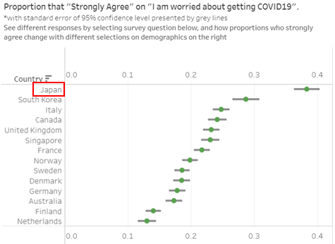
```

```{r}
knitr::include_graphics("japangovt.png")
```

3.	It was observed that the proportion of respondents across the 14 countries in the age group 56 and over were more receptive towards taking a vaccine if made available, compared to those in age group 18 to 55. This can be observed by the shrinking of the green bars when we compare the older age group vs the younger age group through the diverging stacked bar chart. Based on the error plot, we can also see that the proportions that strongly agree are lower in the younger age group. 

Age 55 and above

```{r}
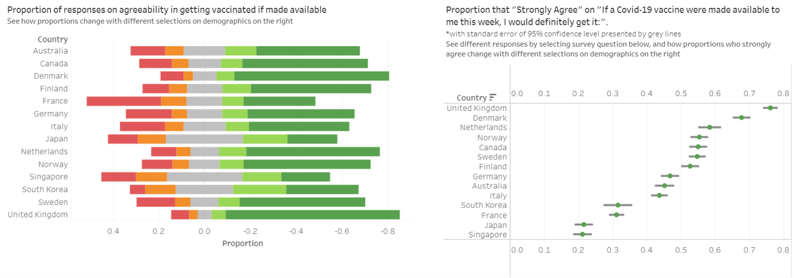
```

Age 18 to 55

```{r}
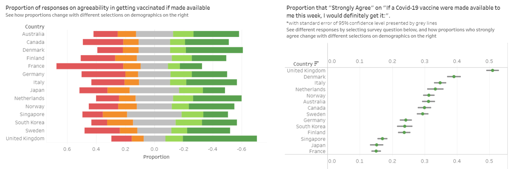
```


