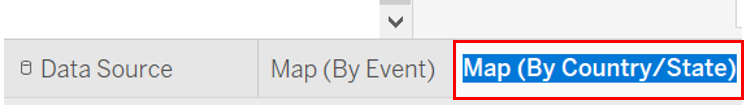
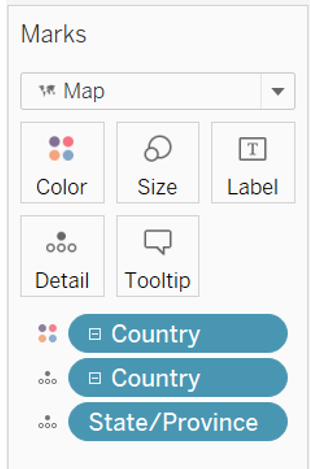
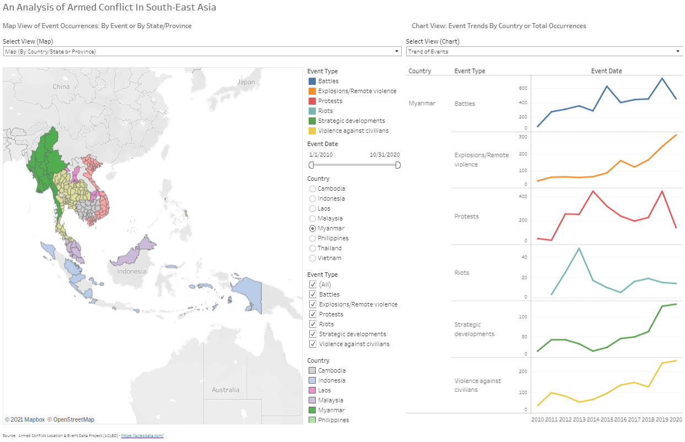
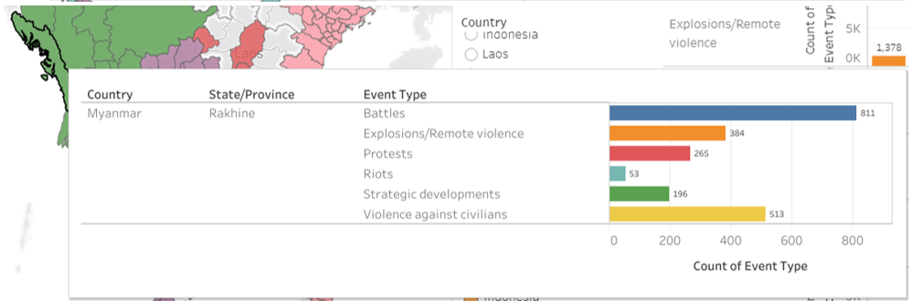

```{r setup, include=FALSE}
knitr::opts_chunk$set(echo = FALSE)
```

<font size="5">**ISSS608 Visual Analytics and Applications - DataViz Makeover 3**
<font size="4">

[Data Visualization (Tableau Online)](https://public.tableau.com/profile/timothy.lim1214#!/vizhome/DataViz3v5/Dashboard3?publish=yes)

Given chart:

```{r}
knitr::include_graphics("givenchart.png")
```

# 1.0 Data Visualization Critique

The given diagram consists of two charts, with the map visualization on the left showing the different events happening in South-East Asia, and a line graph on the right which attempts to visualize the trend of the various event types for each country. Here, the clarity, aesthetics and interactivity will be critiqued. 

<font size="5"> **1.1 Clarity**
<font size="4">

a)	The titles for the charts include useful information such as the country selected and the year range for the map, and indicating conflict event by type on for the trend chart. The title of the new proposed design should also ensure that the title is informative of the described chart.

b) Some of the data points on the map maybe overlapped by other data points of another event at the same location. Hence, having a filter for the event type may be useful in firstly allowing the user to ensure there is no overlap of another event type, and secondly the user is able to specifically look at a certain event type to focus on certain hotspots of a certain event.  

c) The Y-axis on the line graphs are labelled "Count of Sheet1" which is not useful for the user as Sheet1 holds no meaning for the user. It can instead be labelled as "Count".


<font size="5">**1.2 Aesthetics**
<font size="4">

a) On the map chart, the different event types are colour-coded which allows the user to very quickly tell which are the hot spots for each event type in various locations on the map. This colour-coding should be kept for the new proposed design. 

b) The map used is greyscale, which helps to create a stronger contrast against the data points to allow the user to very quickly pick up the data points, compared with maps coloured with terrain and details. 

c) The line graph on the right are all in blue. They can be colour-coded according to the colour-coding done on the map chart to have a consistent distinction between the different event types.  


<font size="5">**1.3 Interactivity**
<font size="4">

a) The details in the tool tip on the map chart is not useful for the user, specifically the event ID, latitude and longitude. Instead, the name of the country and province or state, the groups involved in the event, the date of event and some notes on the specific event will be more useful for the user to have a very quick overview of the event that occurred. 

b) A date slider can be implemented for the user to choose a specific date range in the event his or her interest is only for a particular time frame. 

# 2.0 The New Design

<font size="5">**2.1 Draft Design**
<font size="4">

Taking into account the points mentioned above, a proposed design was drafted as below.

```{r}
knitr::include_graphics("draft.jpg")
```


**Advantages of this design:**

- New tooltip to allow users to see the details of each event occurrence by doing a mouse-over on the datapoint. 

- Another map that allows the user to toggle to see the total events by event type for each province/state in each country by hovering his or her cursor over the particular state. The user can then get a clearer idea of the number of cases that occurred from the first map chart based on the hotspots observed.

- A filter implemented for event type so that users can decide to see only a certain event type which prevents any overlapping of other event types, and to have a clear view of the hot spots of a certain event type.

- A filter to allow the user to specify the date range for observation in the event the user only has a certain time frame of interest.  

- On top of showing the trend of event occurrences, a bar chart plot that the user can toggle to see the breakdown of total event types occurring for each country. 

- Two view selectors implemented for the maps and the charts


<font size="5">**2.2 Preparation of Data Visualization**
<font size="4">

The data used was obtained from [The Armed Conflict Location & Event Data Project (ACLED)](https://acleddata.com/).

The data obtained consists of 1 Microsoft Excel Workbook, containing data of event types of armed conflict for countries in South-East Asia. 


**Importing Data Into Tableau and Data Preparation:**

The Excel file was dragged into the Tableau window, which automatically loads the data in Tableau itself. Here, the Event Date was set as a Date field, while Country, Latitude and Longitude were set in their respective geographical roles. 

```{r}
knitr::include_graphics("datefield.png")
```

```{r}
knitr::include_graphics("country.png")
```

```{r}
knitr::include_graphics("longlat.png")
```

<font size="5">**2.3 Creating The Sheets For The Dashboard**
<font size="4">

**Creating Map (By Event) Sheet:**

Under Sheet 1, Admin 1 was renamed as State/Province, and then set as a State/Province under the geographical role. 

```{r}
knitr::include_graphics("stateprov.png")
```

Longitude and Latitude were dragged into Columns and Rows respectively. The map should be automatically generated. 

```{r}

```

A hierarchy for the location made up of Country and State/Province was created and named Country/Province or State. This was done by firstly clicking under Country and selecting Hierarchy, then select Create Hierarchy, followed by naming the hierachy. 

```{r}
knitr::include_graphics("createhierarchy.png")
```

```{r}
knitr::include_graphics("namehierarchy.png")
```

State/Province was dragged under Country, in the Country/Province or State hierarchy field to form the next layer of the hierarchy.

```{r}

```

Event Type, Event Id Cnty, Country/Province or State, Notes, Actor 1, Actor 2, Event Date were dragged and dropped into Detail. Country was expanded to show State/Province by clicking on the plus sign, then the same was done for YEAR(Event Date) to show both the month, then repeated for Month to show the day. 

```{r}

```

Country and Event Type were dragged and dropped into Filter.

```{r}
knitr::include_graphics("filtercountryandeventtype.png")
```

Event Date was subsequently dragged and dropped into Filter, then Range of Dates was selected, followed by OK.

```{r}

```

```{r}
knitr::include_graphics("rangeofdates2.png")
```

Then show filter by clicking the drop down arrow and select Show Filter.

```{r}

```

The tooltip was edited by clicking on the Tooltip icon under Marks, then the below inputs were added.

```{r}

```

Sheet 1 was then renamed as Map (By Event)

```{r}

```

**Creating Bar Chart Sheet:**

In a new sheet renamed as Bar Chart, Event Type was dragged into Columns, and Country/Province or State and Event Type were dragged into Rows. Then, the plus sign under Country was clicked on to expand, showing State/Province. 

```{r}

```

Event Type was then changed to Count by clicking on the drop down arrow, then selecting Measure, followed by Count. 

```{r}
knitr::include_graphics("count.png")
```

```{r}
knitr::include_graphics("aftercount.png")
```

The chart type was set as Bar, and Event Type was dragged into Color. 

```{r}

```

Data labels were created by clicking on the Label icon, then checking the Show mark labels checkbox. 

```{r}

```

**Creating Map (By Country/State) Sheet:**

The Map (By Event) sheet was duplicated and renamed as Map (By Country/State).

```{r}
knitr::include_graphics("duplicate.png")
```

```{r}

```

Under the Marks section, Event Type and Event Id Cnty were removed, and Country/Province or State were added into Color and Detail. For the field Country/Province or State under Detail, the plus sign was clicked to expand the hierarchy to show state and province as well. 

```{r}

```

AVG(Longitude) and AVG(Latitude) were replaced by Longitude (generated) and Latitude (generated) in Columns and Rows respectively.

```{r}

```

Country and Event Type were removed from the Filter, leaving Event Date behind. Then, the Tooltip icon was selected and edited to show the following.

```{r}
knitr::include_graphics("barcharttooltip.png")
```

To avoid confusion between color coding of countries and events, the Country field color palette was changed. 

```{r}
knitr::include_graphics("countrieseditcolor.png")
```

**Creating Trend Sheet:**

A new sheet was created and renamed Trend. In the new sheet, Event Date was dragged into Columns, and Country/Province or State and two Event Type into Rows. One of the Event Types dragged into Rows was changed to Count. 

```{r}

```

Then, Event Date and Country were dragged into Filters. 

```{r}
knitr::include_graphics("trendsheetmarksandfilter.png")
```

**Creating Bar Chart (Total) Sheet:**

A new sheet was created and renamed Bar Chart (Total). In this new sheet, Country/Province or State was dragged into Columns, then two Event Type were dragged into Rows. One Event Type was changed to Count. 

```{r}
knitr::include_graphics("barchartcolumnandrow.png")
```

Event Type was dragged into Color. 

```{r}

```

**Creating the Page Selector:**

A parameter was created by right-clicking in the Data tab, then selecting Create Parameter. The first parameter was created for Select View (Map), and another for Select View (Chart). 

```{r}
knitr::include_graphics("createparameter.png")
```

```{r}

```

```{r}

```

Then, a calculated field was created for each Select View. The respective Select View type parameter was dragged into their respective calculated field. 

```{r}
knitr::include_graphics("calcfield.png")
```

```{r}
knitr::include_graphics("selectview.png")
```

In each individual sheet, the Select View calculated field was dragged into Filter. Specifically, Map (By Event) and Map (By Country/Province or State) were filtered by Select View (Map), while Trend and Bar Chart (Total) were filtered by Select View (Chart). 

In the Filter pop up box, Custom value list was selected, and the required selection were input. 

```{r}

```

Finally, the Show Filter was selected for the four sheets. 

<font size="5">**2.4 Creating The Dashboard**
<font size="4">

The size of the dashboard was firstly changed to automatic.

```{r}

```

Then, two vertical containers were put side by side.

```{r}
knitr::include_graphics("vertical.png")
```

```{r}

```

The Map (By Event) sheet was first dragged into the left container, and the title was hidden. Then, the Map (By Country/Province or State) was dragged on top of the Map (By Event) sheet, and the title was also hidden. Then, the Select View (Map) filter was dragged to the top. 

This was repeated for the Trend sheet and Bar Chart (Total) sheet. 

```{r}
knitr::include_graphics("sidebyside.png")
```

Chart titles were added by dragging text boxes on top of both vertical containers. Then, another text box was dragged on top of everything and the dashboard title was inserted.

```{r}

```

Finally, the source was added using a text box below everything, giving the final result of the proposed dashboard. 

```{r}

```

# 2.0 Observations

**Observation 1**

Based on the chart for total occurrences, it can be observed that Myanmar has the highest number of battles at 4399 cases, compared to the other South-East Asian countries, accumulating more than twice the number of battles than Philippines which is ranked second. 

```{r}

```

Going to the Map (By Event) chart, there are two main hotspots as seen below, as seen from clusters of blue data points.

```{r}

```

From the Map (By Country/State or Province) chart, these hotspots are contributed by Rakhine, Shan, and Kachin provinces where Shan contributed almost half of the total occurrences in Myanmar. 

```{r}
knitr::include_graphics("shan.png")
```

```{r}

```

```{r}

```


**Observation 2**

Philippines was observed to have the highest number of violence against civilians events, totalling 6621 cases. This was almost three times more than Myanmar which has the second highest number of events of violence against civilians.  

```{r}

```

Looking at the trend, in 2016, Philippines experienced the highest number of such cases. 

```{r}
knitr::include_graphics("philviolencetrend.png")
```

There were no specific hotspots for these cases and going into further details, most of the cases were due to drugs, which is in line with President Rodrigo Duterte carrying out a war on drugs where he ordered the police force to kill anyone suspected to have any form a relation to drugs. 

```{r}
knitr::include_graphics("philviolencehotspots.png")
```


**Observation 3**

Thailand encountered an unusual spike in protests in 2020, shooting up from 164 cases in 2019 to 679 cases in 2020. This was likely contributed by the protests for democracy against Prime Minister Prayut Chan-o-cha’s government. This later grew to include anti-royal protests.  

```{r}

```

**Observation 4**

In 2010, Thailand experienced the highest number of battles between 2010 to 2020 at 264 occurrences. 
 
```{r}

```

An obvious hotspot for battles in 2010 can be seen at the South of Thailand, which could be contributed significantly by the Southern Thailand insurgency as many of the occurrences involved the Muslim Malay Separatists. 

```{r}

```

**Observation 5**

A spike in violence against civilians could be observed in 2018 in Thailand. 

```{r}

```

These events could be seen to be happening in the Southern region of Thailand, in the same region as the battles observed in Observation 4. Going through the notes of the cases, they were mostly caused by Malay Muslim Separatists, who are involved in the insurgency discussed in Observation 4. 

```{r}

```

